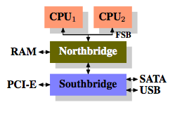

What Every Programmer Should Know About Memory
----

Ulrich Drepper Red Hat, Inc. drepper@redhat.com

November 21, 2007

## 摘要

现在 CPU 的核越来越多，并且越来越快了。大部分程序的性能瓶颈是内存。
硬件的设计者提出了很内存的加速方法，比如说 CPU Cache，但不注意运用
它们的话，也不会达到最优效果。
很遗憾，大多数程序猿都不清楚内存子系统的结构和 CPU Cache 的开销。这篇文章介绍了现代硬件的内存子系统结构，介绍了为什么
要发明 CPU Cache，它们是怎么工作的，为什么程序猿应该更好的利用它们来优化程序。

## 1 介绍

在早期，计算机的构造很简单。CPU、内存、硬盘、网卡，被整合在一起，并且它们的性能很接近。比如说，内存和网卡的速度并不比 CPU 快多少。

当计算机的基本构成确定下来以后，硬件开发者们开始优化各个部件，于是这种情况就发生了改变。一些部件的性能远远落了下来，瓶颈开始出现。特别是内存和硬盘，由于价格原因，它们的速度比别的子系统慢。

硬盘慢，通常可以用软件的方法来改善：操作系统把经常访问的数据放到内存里，这样比从硬盘取要快许多倍。

不像硬盘，如果要改动内存子系统，是非常困难的，牵扯的硬件改动比较多。有这几方面：

* 内存的硬件设计（速度、并行） 
* 内存控制器的设计
* CPU Cache 的设计
* 设备 DMA 的设计

本文大部分篇幅，都是在讲述 CPU Cache 和内存控制器的设计。在探索这些话题的过程中，我们会介绍 DMA，并把它放到全局来讲。
我们会先针对当今的市面上常见的硬件产品，讲它们的结构，这是了解问题和瓶颈的前提。我们还会详细的介绍不同种类的内存，以及它们存在的意义。

本文不可能非常全面，它只是介绍了市面上的硬件产品的其中一部分。另外本文也是不够详细的，如果想知道更多，去找更详细的论文吧（译者注：我草这还叫不够详细）。

本文提到的代码，只针对 Linux 系统，作者对其他操作系统不感兴趣。如果你想在别的操作系统使用这些代码，就去找它的厂商，叫它写一份像本文一样的文档出来。

在开始前最后说一句。本文所说的“通常情况”，是针对常见的版本的硬件或者软件，不能涵盖所有情况。

## 文档结构

本文是写给程序猿看的，不是硬件开发者。但在提到代码优化之前，会介绍很多的底层硬件细节。

为此，第二章会介绍 RAM（random-access memory）的硬件细节。这个章节的内容如果能理解就最好了，但不理解的话也不会对下面的章节造成影响，心急的读者可以略过这章。

第三章详细地介绍 CPU Cache 的行为。伴有图表说明，避免文字的乏味。这一章对于理解后面的章节很重要。

第四章简单的介绍了虚拟内存（Virtual Memory）的实现。

第五章详细地介绍了 NUMA（Non Uniform Memory Access）系统。

第六章是本文的核心。它总结了前面几章的内容，并给出了代码优化的建议，以及怎样写出在大多数情况下运行比较快的代码。非常不耐烦的读者可以从这章开始看起，如果需要的话，再回头看前面的几张补充知识。

第七章介绍了一些性能优化的工具。有的性能问题在软件工程中藏得很深，即便是理解了本文的精髓，也未必能明显地找出它们，所以这些工具是很有用的。

第八章我们展望了未来可能出现的技术。

## 2 今天市面上的硬件

研究当今市面上的硬件，比研究其他的特殊硬件要重要一些。因为所有东西都是朝着并行的方向发展，多个便宜的计算机组成的分布式系统取代了一些大型机。这是事实，因为又快又便宜的网络已经很普遍了。大型机还有市场，但基本上快没了。RedHat，在 2007 年预测未来的数据中心会由四颗 CPU 的计算机组成，每个 CPU 又有超线程，所以最终会有 64 个虚拟核心，许多代码要针对这些硬件作优化。

这些年来，计算机的硬件结构都包含两大部分：南桥和北桥。

 

